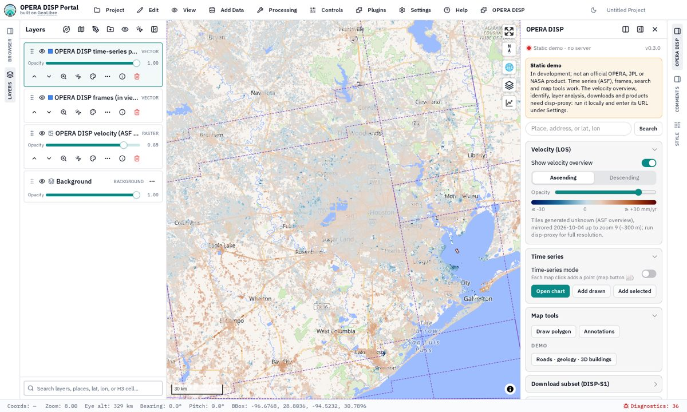
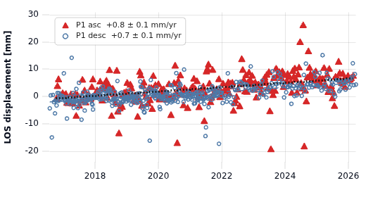

# OPERA DISP Portal

> **🚧 In development** — a community prototype, **not an official OPERA, JPL or NASA product**.
> Results may change without notice; do not use them for decisions.

**▶ Open the viewer: <https://mgovorcin.github.io/disp-portal-dev/>**

A web viewer for [OPERA](https://www.jpl.nasa.gov/go/opera/) DISP-S1 surface displacement over North
America, built as a plugin for [GeoLibre](https://github.com/opengeos/GeoLibre).



## What you can do

- **Velocity overview** — ascending / descending line-of-sight velocity (ASF overview, ±30 mm/yr).
- **Time series** — switch on *Time-series mode* (map button 📈) and click the map, or add drawn
  polygons; series come straight from ASF.
- **Fit and compare** — linear to cubic trends, annual and semi-annual terms, steps, outlier
  rejection, residuals, values relative to another point.
- **Style and export** — click a series swatch to set marker and fit style; *Save PNG* (with
  legend), *Export CSV* and *Export fit*.
- **Context layers** — search places, draw and annotate, and *Map tools → Demo* for Overture roads,
  USGS geology (WMS) and 3D buildings; add your own data through GeoLibre's *Add Data*.



## Static demo vs. local

The GitHub Pages site needs no server. Running `disp-proxy` locally adds the rest:

| | Pages | Local `disp-proxy` |
|---|---|---|
| Velocity overview | mirrored to ~150 m (monthly) | full resolution (~38 m) |
| Time series, fits, exports, context layers | ✅ | ✅ |
| Click-to-identify, layer analysis | – | ✅ |
| Subset downloads (GeoZarr / COG), products | – | ✅ |

The static site can use a local proxy too: start it and enter `http://localhost:8790` under
**OPERA DISP → Settings**.

```bash
uv sync && .venv/bin/disp-proxy --port 8790   # API on http://localhost:8790
scripts/build_geolibre.sh                     # once: bundled GeoLibre served at http://localhost:8790/
```

Details, including the conda environment for downloads, are in [Running locally](docs/local-setup.md).

## Documentation

- [Running locally](docs/local-setup.md) — setup, `disp-proxy` API, self-hosted GeoLibre build
- [Plugin features](docs/plugin.md) — everything in the OPERA DISP panel, build and tests
- [Downloads and products](docs/downloads-and-products.md) — subsets and whole-frame velocity
- [GitHub Pages build](docs/github-pages.md) — static site and the overview mirror
- [Plan](docs/PLAN.md) and [prototype notes](docs/PHASE0_NOTES.md)

## License and credits

Apache-2.0 ([LICENSE](LICENSE), [NOTICE](NOTICE)); software release under JPL review.
AI assistance is noted in [AI_PROVENANCE.md](AI_PROVENANCE.md).

- [GeoLibre](https://github.com/opengeos/GeoLibre) (MIT, © Qiusheng Wu): the web GIS this plugin runs in.
- OPERA DISP-S1 products and time-series service: [ASF DAAC](https://asf.alaska.edu/) /
  [NASA Earthdata](https://www.earthdata.nasa.gov/); [opera-utils](https://github.com/opera-adt/opera-utils).
- Demo layers: [Overture Maps](https://overturemaps.org/) (roads, buildings; ODbL / CDLA),
  USGS [State Geologic Map Compilation](https://mrdata.usgs.gov/geology/state/) (WMS).
- Basemaps: [OpenFreeMap](https://openfreemap.org/), © OpenStreetMap contributors,
  Sentinel-2 cloudless by [EOX](https://s2maps.eu/).
- The OPERA logo belongs to the OPERA project (JPL); used here only to identify the data source.
